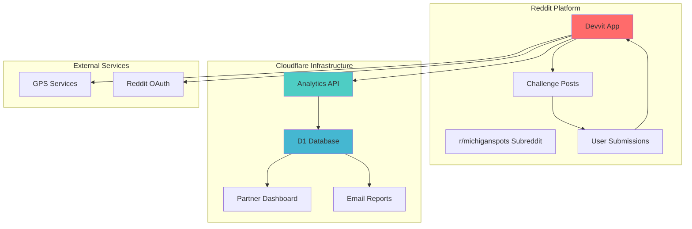
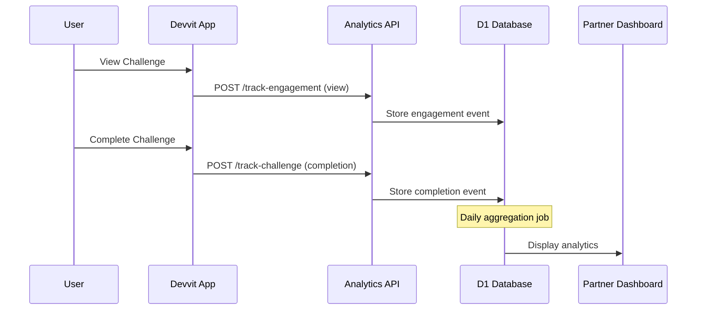

# Design Document

## Overview

The Michigan Spots Reddit treasure hunt game is a hybrid system that combines a Devvit app running natively on Reddit with the existing Cloudflare Workers analytics backend. The game creates an engaging community experience where Reddit users discover local Michigan businesses through GPS-verified challenges while providing partners with measurable ROI data.

The system leverages Reddit's native social features (comments, upvotes, awards) while seamlessly integrating with the existing analytics infrastructure to track real business value for partners.

## Architecture

### System Architecture Diagram



### Component Architecture

The system consists of three main architectural layers:

1. **Presentation Layer (Devvit App)**: Native Reddit interface for game interactions
2. **Business Logic Layer (Cloudflare Workers)**: Analytics processing and partner services  
3. **Data Layer (D1 Database + Redis)**: Persistent storage and caching

### Data Flow Architecture



## Components and Interfaces

### 1. Devvit App Components

#### Challenge Browser Component
- **Purpose**: Display active challenges in a Reddit-native interface
- **Location**: Main subreddit view and custom app pages
- **State Management**: Devvit KV store for user preferences and filters

```typescript
interface ChallengeBrowserProps {
  challenges: Challenge[];
  userCompletions: Set<string>;
  filters: ChallengeFilters;
}

interface Challenge {
  id: string;
  title: string;
  description: string;
  partnerId: string;
  partnerName: string;
  difficulty: 'easy' | 'medium' | 'hard';
  points: number;
  startDate: Date;
  endDate: Date;
  location: GPSCoordinate;
  proofRequirements: ProofType[];
  status: 'active' | 'expired' | 'completed';
}
```

#### Challenge Detail Component
- **Purpose**: Show comprehensive challenge information and submission interface
- **Analytics Integration**: Triggers view events on component mount
- **GPS Integration**: Real-time location verification for submissions

```typescript
interface ChallengeDetailProps {
  challenge: Challenge;
  userLocation?: GPSCoordinate;
  submissionHistory: Submission[];
}

interface Submission {
  id: string;
  userId: string;
  challengeId: string;
  proofType: ProofType;
  proofData: any;
  submittedAt: Date;
  verificationStatus: 'pending' | 'approved' | 'rejected';
  redditPostUrl?: string;
}
```

#### User Progress Component
- **Purpose**: Display user achievements, points, and leaderboard position
- **Data Source**: Devvit Redis for real-time updates, synced with Cloudflare

```typescript
interface UserProgressProps {
  userId: string;
  totalPoints: number;
  completedChallenges: Challenge[];
  badges: Badge[];
  leaderboardRank: number;
}

interface Badge {
  id: string;
  name: string;
  description: string;
  iconUrl: string;
  earnedAt: Date;
  criteria: BadgeCriteria;
}
```

#### Leaderboard Component
- **Purpose**: Show community rankings and competitive elements
- **Update Frequency**: Real-time via Devvit Redis, daily sync with analytics

```typescript
interface LeaderboardProps {
  type: 'individual' | 'city';
  timeframe: 'weekly' | 'monthly' | 'alltime';
  entries: LeaderboardEntry[];
  currentUserRank?: number;
}

interface LeaderboardEntry {
  rank: number;
  username: string;
  points: number;
  badgeCount: number;
  completedChallenges: number;
}
```

### 2. Analytics API Components

#### Event Tracking Service
- **Purpose**: Receive and process events from Devvit app
- **Endpoints**: `/api/analytics/track-engagement`, `/api/analytics/track-challenge`
- **Authentication**: API key validation with rate limiting

```typescript
interface EngagementEvent {
  eventType: 'view' | 'comment' | 'upvote' | 'share' | 'award';
  challengeId: number;
  spotId?: number;
  userRedditUsername: string;
  postId: string;
  commentId?: string;
  eventData?: Record<string, any>;
  timestamp: string;
}

interface ChallengeCompletion {
  challengeId: number;
  userRedditUsername: string;
  submissionUrl: string;
  submissionType: 'post' | 'comment';
  completedAt: string;
  gpsCoordinates: GPSCoordinate;
  proofType: ProofType;
}
```

#### Analytics Aggregation Service
- **Purpose**: Process raw events into partner-friendly metrics
- **Schedule**: Daily at 2 AM EST via Cloudflare Workers cron
- **Output**: Aggregated data in `partner_analytics_daily` table

```typescript
interface DailyAnalytics {
  partnerId: number;
  date: string;
  challengeViews: number;
  challengeCompletions: number;
  challengeComments: number;
  challengeUpvotes: number;
  challengeShares: number;
  challengeAwards: number;
  uniqueParticipants: number;
  engagementRate: number;
}
```

### 3. GPS Verification System

#### Location Verification Service
- **Purpose**: Validate user proximity to business locations
- **Accuracy**: 100-meter radius verification
- **Fraud Prevention**: Multiple validation layers

```typescript
interface GPSCoordinate {
  latitude: number;
  longitude: number;
  accuracy?: number;
  timestamp?: Date;
}

interface LocationVerification {
  isValid: boolean;
  distance: number;
  accuracy: number;
  fraudRisk: 'low' | 'medium' | 'high';
  verificationMethod: 'gps' | 'network' | 'manual';
}

class LocationVerificationService {
  async verifyLocation(
    userLocation: GPSCoordinate,
    businessLocation: GPSCoordinate
  ): Promise<LocationVerification>;
  
  async detectSpoofing(
    location: GPSCoordinate,
    userHistory: GPSCoordinate[]
  ): Promise<boolean>;
}
```

### 4. Proof Submission System

#### Proof Validation Service
- **Purpose**: Validate different types of challenge proof
- **Types**: Photo, receipt, GPS check-in, location-specific questions

```typescript
type ProofType = 'photo' | 'receipt' | 'gps_checkin' | 'location_question';

interface ProofSubmission {
  type: ProofType;
  data: PhotoProof | ReceiptProof | GPSProof | QuestionProof;
  metadata: {
    timestamp: Date;
    location: GPSCoordinate;
    deviceInfo: string;
  };
}

interface PhotoProof {
  imageUrl: string;
  hasBusinessSignage: boolean;
  hasInteriorView: boolean;
  gpsEmbedded: boolean;
}

interface ReceiptProof {
  imageUrl: string;
  businessName: string;
  timestamp: Date;
  amount?: number;
}
```

## Data Models

### Core Game Entities

#### Challenge Model
```typescript
interface Challenge {
  id: string;
  title: string;
  description: string;
  partnerId: string;
  partnerName: string;
  partnerBranding: {
    logoUrl: string;
    primaryColor: string;
    secondaryColor: string;
  };
  difficulty: 'easy' | 'medium' | 'hard';
  points: number;
  startDate: Date;
  endDate: Date;
  location: {
    coordinates: GPSCoordinate;
    address: string;
    businessName: string;
    verificationRadius: number; // meters
  };
  proofRequirements: {
    types: ProofType[];
    instructions: string;
    examples?: string[];
  };
  status: 'draft' | 'active' | 'expired' | 'completed';
  maxCompletions?: number;
  redditPostId?: string;
  createdAt: Date;
  updatedAt: Date;
}
```

#### User Profile Model
```typescript
interface UserProfile {
  redditUsername: string;
  totalPoints: number;
  completedChallenges: string[];
  badges: Badge[];
  joinedAt: Date;
  lastActiveAt: Date;
  preferences: {
    notifications: boolean;
    leaderboardVisible: boolean;
    locationSharing: boolean;
  };
  statistics: {
    totalSubmissions: number;
    successfulSubmissions: number;
    averageCompletionTime: number;
    favoritePartners: string[];
  };
}
```

#### Submission Model
```typescript
interface Submission {
  id: string;
  challengeId: string;
  userRedditUsername: string;
  proofType: ProofType;
  proofData: any;
  submittedAt: Date;
  verificationStatus: 'pending' | 'approved' | 'rejected';
  verificationNotes?: string;
  redditPostUrl?: string;
  redditCommentUrl?: string;
  gpsCoordinates: GPSCoordinate;
  fraudRiskScore: number;
  reviewedBy?: string;
  reviewedAt?: Date;
}
```

### Analytics Data Models

#### Engagement Event Model
```typescript
interface EngagementEvent {
  id: string;
  eventType: 'view' | 'comment' | 'upvote' | 'share' | 'award';
  challengeId: string;
  spotId?: string;
  userRedditUsername: string;
  postId: string;
  commentId?: string;
  eventData: Record<string, any>;
  createdAt: Date;
  sessionId?: string;
  userAgent?: string;
  ipAddress?: string; // hashed for privacy
}
```

#### Partner Analytics Model
```typescript
interface PartnerAnalytics {
  partnerId: string;
  date: string; // YYYY-MM-DD
  metrics: {
    challengeViews: number;
    challengeCompletions: number;
    challengeComments: number;
    challengeUpvotes: number;
    challengeShares: number;
    challengeAwards: number;
    uniqueParticipants: number;
    engagementRate: number;
    costPerVisit: number;
    returnVisitors: number;
  };
  topChallenges: {
    challengeId: string;
    completions: number;
    views: number;
  }[];
  topParticipants: {
    username: string;
    completions: number;
    points: number;
  }[];
}
```

## Error Handling

### Error Classification System

#### Client-Side Errors (Devvit App)
- **GPS Unavailable**: Graceful degradation to manual location entry
- **Network Connectivity**: Offline mode with sync when reconnected
- **Permission Denied**: Clear messaging and alternative proof methods
- **Invalid Submissions**: Real-time validation with helpful error messages

```typescript
enum ErrorType {
  GPS_UNAVAILABLE = 'GPS_UNAVAILABLE',
  LOCATION_TOO_FAR = 'LOCATION_TOO_FAR',
  INVALID_PROOF = 'INVALID_PROOF',
  CHALLENGE_EXPIRED = 'CHALLENGE_EXPIRED',
  ALREADY_COMPLETED = 'ALREADY_COMPLETED',
  NETWORK_ERROR = 'NETWORK_ERROR',
  AUTHENTICATION_ERROR = 'AUTHENTICATION_ERROR'
}

interface GameError {
  type: ErrorType;
  message: string;
  userMessage: string;
  recoverable: boolean;
  retryable: boolean;
  context?: Record<string, any>;
}
```

#### Server-Side Errors (Analytics API)
- **API Rate Limiting**: Exponential backoff with circuit breaker pattern
- **Database Failures**: Graceful degradation and retry mechanisms
- **External Service Failures**: Fallback strategies and monitoring

```typescript
class ErrorHandler {
  async handleAnalyticsError(error: Error, context: any): Promise<void> {
    // Log error with context
    console.error('Analytics error:', error, context);
    
    // Attempt retry with exponential backoff
    if (this.isRetryable(error)) {
      await this.retryWithBackoff(context.operation, context.data);
    }
    
    // Alert monitoring systems
    await this.alertMonitoring(error, context);
  }
  
  private isRetryable(error: Error): boolean {
    return error.name === 'NetworkError' || 
           error.name === 'TimeoutError' ||
           (error as any).status >= 500;
  }
}
```

### Fraud Prevention System

#### Multi-Layer Validation
1. **GPS Validation**: Distance and accuracy checks
2. **Temporal Validation**: Reasonable travel time between submissions
3. **Pattern Detection**: Unusual submission patterns
4. **Photo Analysis**: Basic image validation for business presence

```typescript
class FraudDetectionService {
  async validateSubmission(submission: Submission): Promise<ValidationResult> {
    const checks = await Promise.all([
      this.validateGPS(submission.gpsCoordinates, submission.challengeId),
      this.validateTiming(submission.userRedditUsername, submission.submittedAt),
      this.validateProof(submission.proofData, submission.proofType),
      this.checkUserHistory(submission.userRedditUsername)
    ]);
    
    return this.aggregateValidationResults(checks);
  }
  
  private async validateGPS(
    coordinates: GPSCoordinate, 
    challengeId: string
  ): Promise<ValidationCheck> {
    const challenge = await this.getChallengeLocation(challengeId);
    const distance = this.calculateDistance(coordinates, challenge.location);
    
    return {
      passed: distance <= challenge.verificationRadius,
      confidence: this.calculateConfidence(coordinates.accuracy, distance),
      details: { distance, accuracy: coordinates.accuracy }
    };
  }
}
```

## Testing Strategy

### Unit Testing Strategy

#### Devvit App Components
- **Component Rendering**: Test all UI components render correctly
- **User Interactions**: Test button clicks, form submissions, navigation
- **State Management**: Test Redux/context state updates
- **GPS Functions**: Mock GPS services for location testing

```typescript
// Example test structure
describe('ChallengeDetailComponent', () => {
  it('should render challenge information correctly', () => {
    const mockChallenge = createMockChallenge();
    render(<ChallengeDetail challenge={mockChallenge} />);
    expect(screen.getByText(mockChallenge.title)).toBeInTheDocument();
  });
  
  it('should trigger analytics event on view', async () => {
    const mockAnalytics = jest.fn();
    render(<ChallengeDetail challenge={mockChallenge} analytics={mockAnalytics} />);
    expect(mockAnalytics).toHaveBeenCalledWith('view', mockChallenge.id);
  });
});
```

#### Analytics API Functions
- **Event Processing**: Test event validation and storage
- **Aggregation Logic**: Test daily analytics calculations
- **Error Handling**: Test retry mechanisms and error responses

```typescript
describe('AnalyticsService', () => {
  it('should process engagement events correctly', async () => {
    const event = createMockEngagementEvent();
    const result = await analyticsService.processEvent(event);
    expect(result.success).toBe(true);
    expect(mockDatabase.insert).toHaveBeenCalledWith('engagement_events', event);
  });
  
  it('should handle invalid events gracefully', async () => {
    const invalidEvent = { eventType: 'invalid' };
    const result = await analyticsService.processEvent(invalidEvent);
    expect(result.success).toBe(false);
    expect(result.error).toContain('Invalid event type');
  });
});
```

### Integration Testing Strategy

#### End-to-End User Flows
- **Challenge Completion Flow**: From viewing to successful submission
- **Analytics Data Flow**: From Devvit event to partner dashboard
- **Error Recovery**: Network failures and retry mechanisms

```typescript
describe('Challenge Completion Flow', () => {
  it('should complete full user journey', async () => {
    // 1. User views challenge
    await userViewsChallenge(challengeId);
    expect(analyticsAPI.trackEngagement).toHaveBeenCalledWith('view');
    
    // 2. User submits proof
    await userSubmitsProof(challengeId, mockProof);
    expect(analyticsAPI.trackChallenge).toHaveBeenCalledWith(completion);
    
    // 3. Verify data in partner dashboard
    const analytics = await getPartnerAnalytics(partnerId);
    expect(analytics.challengeCompletions).toBe(1);
  });
});
```

#### API Integration Tests
- **Authentication**: Test API key validation
- **Rate Limiting**: Test request throttling
- **Data Consistency**: Test data flow between systems

### Performance Testing Strategy

#### Load Testing Scenarios
- **Concurrent Users**: 1000+ simultaneous challenge views
- **Analytics Burst**: High-volume event processing
- **Database Performance**: Query optimization under load

#### Monitoring and Metrics
- **Response Times**: API endpoints <100ms average
- **Error Rates**: <1% error rate for all operations
- **Data Accuracy**: 100% event capture rate
- **User Experience**: <2 second page load times

```typescript
// Performance monitoring setup
const performanceMetrics = {
  apiResponseTime: new Histogram('api_response_time_seconds'),
  eventProcessingRate: new Counter('events_processed_total'),
  errorRate: new Counter('errors_total'),
  userEngagement: new Gauge('active_users_current')
};
```

This comprehensive design provides a solid foundation for implementing the Michigan Spots Reddit treasure hunt game while ensuring scalability, reliability, and seamless integration with the existing analytics infrastructure.