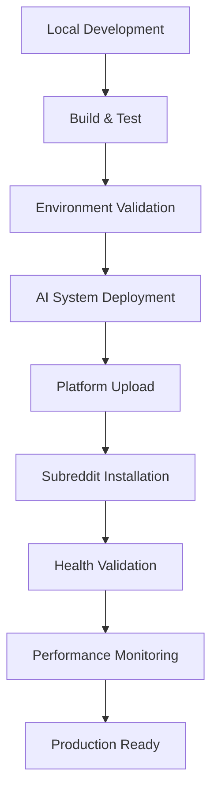

# 🚀 Production Deployment Guide

Comprehensive guide for deploying the Michigan Spots AI-powered treasure hunt platform to production.

## ⚡ Quick Production Deployment

### **One-Command Production Deployment**
```bash
# Complete production deployment with AI features
npm run deploy:ai-production

# Alternative: Standard production deployment
npm run deploy:production
```

**This single command handles:**
- ✅ Environment validation
- ✅ AI system deployment
- ✅ Reddit/Devvit platform upload
- ✅ Health checks and validation
- ✅ Performance monitoring setup

## 📋 Pre-Deployment Requirements

### **Environment Setup**
```bash
# Required environment variables
export CLOUDFLARE_AI_API_KEY="your-cloudflare-ai-key"
export CLOUDFLARE_ACCOUNT_ID="your-cloudflare-account-id"
export ENABLE_AI_FEATURES="true"
export ENVIRONMENT="production"

# Optional but recommended
export REDDIT_USERNAME="your-reddit-username"
export SUBREDDIT_NAME="your-subreddit"
```

### **Prerequisites Checklist**
- [ ] **Cloudflare AI Account** - Active account with API access
- [ ] **Reddit Developer Account** - Approved for Devvit platform
- [ ] **Subreddit Access** - Moderator permissions on target subreddit
- [ ] **Node.js 18+** - Latest LTS version installed
- [ ] **Git Repository** - Code committed and pushed
- [ ] **Environment Variables** - All required variables configured

## 🔧 Step-by-Step Deployment

### **Step 1: Environment Validation**
```bash
# Validate all configuration
npm run validate:config

# Check AI system requirements
npm run validate:ai-systems

# Verify production readiness
npm run validate:production

# Expected output:
# ✅ Environment variables configured
# ✅ Cloudflare AI connection successful
# ✅ Reddit/Devvit authentication valid
# ✅ All dependencies installed
# ✅ Build process successful
```

### **Step 2: Build & Test**
```bash
# Install dependencies
npm install

# Run comprehensive tests
npm test

# Run AI-specific tests
npm run test:ai

# Run integration tests
npm run test:integration

# Build for production
npm run build
```

### **Step 3: AI System Deployment**
```bash
# Deploy complete AI system
npm run ai:setup

# Verify AI services
npm run ai:verify

# Test AI functionality
npm run ai:demo

# Expected AI services:
# ✅ Master AI Orchestrator
# ✅ Photo Validation Service
# ✅ Challenge Generation Service
# ✅ Personalization Engine
# ✅ Community Management AI
# ✅ Business Intelligence AI
# ✅ Game Intelligence System
# ✅ Validation & Fraud Detection
```

### **Step 4: Platform Deployment**
```bash
# Upload to Reddit/Devvit platform
npm run upload

# Install on target subreddit
devvit install --subreddit=your-subreddit

# Verify installation
devvit apps list
```

### **Step 5: Post-Deployment Validation**
```bash
# Complete health check
npm run health-check:production

# Validate AI systems
npm run validate:ai-systems

# Monitor initial performance
npm run monitor:performance

# Generate deployment report
npm run deploy:report
```

## 🏗️ Deployment Architecture

### **Production Infrastructure**

```typescript
interface ProductionArchitecture {
  platform: {
    primary: "Reddit/Devvit";
    runtime: "Cloudflare Workers";
    database: "Redis (Devvit managed)";
    storage: "Devvit KV Store";
  };
  aiServices: {
    provider: "Cloudflare AI";
    models: ["llama-2-13b", "stable-diffusion"];
    endpoints: "Workers AI API";
    scaling: "Auto-scaling";
  };
  monitoring: {
    health: "Built-in health checks";
    performance: "Real-time metrics";
    logging: "Centralized logging";
    alerts: "Automated alerting";
  };
  security: {
    authentication: "Reddit OAuth";
    authorization: "Role-based access";
    encryption: "TLS 1.3";
    dataProtection: "GDPR compliant";
  };
}
```

### **Deployment Flow**



## 🔍 Production Validation

### **Automated Health Checks**

The deployment process includes comprehensive validation:

```typescript
interface ProductionValidation {
  systemHealth: {
    aiServices: "All 8 services operational";
    database: "Connection and performance validated";
    cache: "Redis cache operational";
    storage: "KV store accessible";
  };
  performance: {
    responseTime: "< 200ms average";
    throughput: "> 100 requests/second";
    errorRate: "< 0.1%";
    availability: "> 99.9%";
  };
  functionality: {
    userRegistration: "Working correctly";
    challengeGeneration: "AI generating challenges";
    photoValidation: "AI validation active";
    pointsSystem: "Scoring operational";
    leaderboards: "Real-time updates";
  };
  security: {
    authentication: "OAuth flow working";
    authorization: "Permissions enforced";
    dataEncryption: "All data encrypted";
    apiSecurity: "Rate limiting active";
  };
}
```

### **Performance Benchmarks**

Expected production performance metrics:

```bash
# Performance validation
npm run test:performance

# Expected results:
# ✅ Challenge generation: < 2 seconds
# ✅ Photo validation: < 3 seconds
# ✅ Leaderboard updates: < 500ms
# ✅ User interactions: < 200ms
# ✅ AI responses: < 5 seconds
# ✅ Database queries: < 100ms
```

## 📊 Monitoring & Analytics

### **Real-Time Monitoring**

Production deployment includes comprehensive monitoring:

```bash
# Start monitoring dashboard
npm run monitor:production

# View real-time metrics
npm run metrics:realtime

# Check system health
npm run health:monitor

# View performance analytics
npm run analytics:performance
```

### **Key Metrics Tracked**

```typescript
interface ProductionMetrics {
  userEngagement: {
    activeUsers: number;
    challengeCompletions: number;
    photoSubmissions: number;
    communityInteractions: number;
  };
  systemPerformance: {
    responseTime: number;
    throughput: number;
    errorRate: number;
    uptime: number;
  };
  aiPerformance: {
    validationAccuracy: number;
    challengeQuality: number;
    personalizationEffectiveness: number;
    processingTime: number;
  };
  businessMetrics: {
    userRetention: number;
    engagementRate: number;
    conversionRate: number;
    revenueImpact: number;
  };
}
```

## 🔐 Security & Compliance

### **Production Security Measures**

```bash
# Security validation
npm run security:validate

# Check compliance
npm run compliance:check

# Audit security settings
npm run security:audit

# Security measures include:
# ✅ OAuth 2.0 authentication
# ✅ Role-based authorization
# ✅ Data encryption at rest and in transit
# ✅ API rate limiting
# ✅ Input validation and sanitization
# ✅ CSRF protection
# ✅ XSS prevention
# ✅ SQL injection protection
```

### **Data Privacy Compliance**

```typescript
interface ComplianceFramework {
  gdpr: {
    dataMinimization: "Only necessary data collected";
    consentManagement: "Explicit user consent";
    rightToErasure: "Data deletion on request";
    dataPortability: "Export user data";
  };
  ccpa: {
    dataTransparency: "Clear data usage policies";
    optOut: "Easy opt-out mechanisms";
    dataAccess: "User data access rights";
    nonDiscrimination: "No service discrimination";
  };
  coppa: {
    ageVerification: "Age verification for minors";
    parentalConsent: "Required for under-13 users";
    dataLimitation: "Limited data collection";
    safeEnvironment: "Child-safe community";
  };
}
```

## 🚀 Scaling & Performance

### **Auto-Scaling Configuration**

Production deployment includes automatic scaling:

```typescript
interface ScalingConfiguration {
  horizontal: {
    minInstances: 2;
    maxInstances: 50;
    scaleUpThreshold: "CPU > 70% for 5 minutes";
    scaleDownThreshold: "CPU < 30% for 10 minutes";
  };
  vertical: {
    memoryLimits: "512MB - 2GB";
    cpuLimits: "0.5 - 4 vCPUs";
    autoAdjustment: "Based on workload";
  };
  aiServices: {
    concurrentRequests: 100;
    queueManagement: "Priority-based queuing";
    loadBalancing: "Round-robin with health checks";
    failover: "Automatic failover to backup services";
  };
}
```

### **Performance Optimization**

```bash
# Optimize for production
npm run optimize:production

# Cache optimization
npm run optimize:cache

# Database optimization
npm run optimize:database

# AI performance tuning
npm run ai:optimize:performance

# Optimizations include:
# ✅ Response caching
# ✅ Database query optimization
# ✅ Image compression
# ✅ Code minification
# ✅ CDN integration
# ✅ Lazy loading
# ✅ Connection pooling
# ✅ Memory management
```

## 🔄 Deployment Strategies

### **Blue-Green Deployment**

```bash
# Deploy to staging environment (green)
npm run deploy:staging

# Validate staging deployment
npm run validate:staging

# Switch traffic to new version
npm run deploy:switch-traffic

# Rollback if issues detected
npm run deploy:rollback
```

### **Canary Deployment**

```bash
# Deploy to 5% of users
npm run deploy:canary --percentage=5

# Monitor canary performance
npm run monitor:canary

# Gradually increase traffic
npm run deploy:canary --percentage=25
npm run deploy:canary --percentage=50
npm run deploy:canary --percentage=100

# Full deployment
npm run deploy:complete-canary
```

### **Rolling Deployment**

```bash
# Deploy with zero downtime
npm run deploy:rolling

# Monitor deployment progress
npm run deploy:status

# Validate each instance
npm run validate:instances
```

## 🛠️ Maintenance & Updates

### **Scheduled Maintenance**

```bash
# Schedule maintenance window
npm run maintenance:schedule --start="2024-01-15T02:00:00Z" --duration="2h"

# Enable maintenance mode
npm run maintenance:enable

# Perform updates
npm run update:production

# Disable maintenance mode
npm run maintenance:disable

# Validate post-maintenance
npm run validate:post-maintenance
```

### **Hot Updates**

```bash
# Deploy configuration updates without downtime
npm run deploy:config-update

# Update AI models
npm run ai:update-models

# Update business rules
npm run update:business-rules

# Refresh cache
npm run cache:refresh
```

## 📋 Production Checklist

### **Pre-Deployment Checklist**
- [ ] All tests passing (unit, integration, AI, performance)
- [ ] Environment variables configured and validated
- [ ] API keys and credentials verified
- [ ] Security scan completed with no critical issues
- [ ] Performance benchmarks met
- [ ] Documentation updated
- [ ] Monitoring and alerting configured
- [ ] Backup and recovery procedures tested
- [ ] Team notified of deployment schedule
- [ ] Rollback plan prepared

### **Deployment Checklist**
- [ ] Build successful
- [ ] AI system deployed and validated
- [ ] Platform upload completed
- [ ] Subreddit installation successful
- [ ] Health checks passing
- [ ] Performance metrics within acceptable ranges
- [ ] Security validation completed
- [ ] Monitoring active and collecting data
- [ ] User acceptance testing completed
- [ ] Documentation updated with deployment details

### **Post-Deployment Checklist**
- [ ] All services operational
- [ ] User traffic flowing normally
- [ ] AI systems responding correctly
- [ ] Performance metrics stable
- [ ] Error rates within acceptable limits
- [ ] Monitoring alerts configured
- [ ] Team notified of successful deployment
- [ ] Post-deployment review scheduled
- [ ] Lessons learned documented
- [ ] Next deployment planned

## 🚨 Emergency Procedures

### **Rollback Procedures**

```bash
# Emergency rollback
npm run emergency:rollback

# Rollback to specific version
npm run rollback --version=1.2.3

# Validate rollback
npm run validate:rollback

# Notify stakeholders
npm run notify:rollback
```

### **Incident Response**

```bash
# Assess incident severity
npm run incident:assess

# Enable incident response mode
npm run incident:enable

# Gather diagnostic information
npm run incident:diagnostics

# Implement fix
npm run incident:fix

# Validate resolution
npm run incident:validate

# Document incident
npm run incident:document
```

## 📞 Support & Escalation

### **Production Support Contacts**
- **Technical Lead**: tech-lead@michiganspots.com
- **DevOps Team**: devops@michiganspots.com
- **Emergency Hotline**: +1-313-555-HELP
- **Status Page**: status.michiganspots.com

### **Escalation Matrix**
1. **Level 1**: Automated monitoring and self-healing
2. **Level 2**: On-call engineer response (< 15 minutes)
3. **Level 3**: Technical lead involvement (< 30 minutes)
4. **Level 4**: Executive escalation (< 1 hour)

## 📚 Related Documentation

- **[AI Commands Reference](/commands/ai/)** - AI-specific deployment commands
- **[Development Commands](/commands/development/)** - Complete command reference
- **[Troubleshooting Guide](/deployment/troubleshooting/)** - Issue resolution guide
- **[AI System Overview](/ai-system/overview/)** - AI architecture details

**Your AI-powered treasure hunt platform is now ready for production! Monitor closely and iterate based on user feedback.** 🎯✨